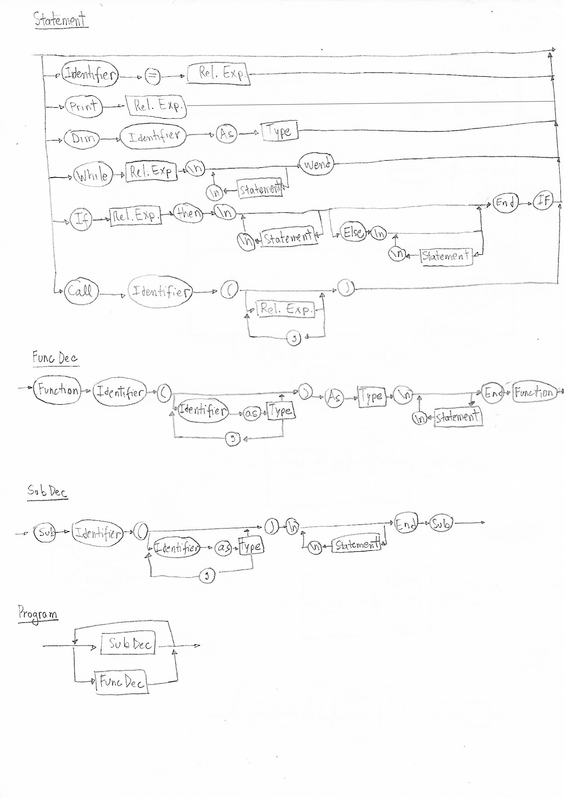
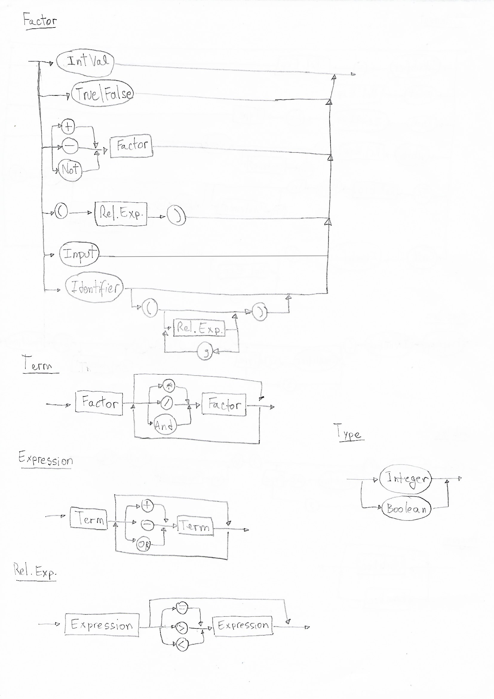

# LogicaDaComputacaoElisa
Elisa Malzoni
Logica da Computação - 2019.1

## DS - EBNF



```

Program = {SubDec | FuncDec}

SubDec = sub, identifier, '(', [identifier, as, Type,{',', identifier, as, Type}], ')', '\n', {statement, '\n'}, end, sub;

FuncDec = function, identifier, '(', [identifier, as, Type], [',', identifier, as, Type], ')', as, Type, '\n', {statement, '\n'}, end, function;

Statement = λ | ( identifier, '=', Rel. Exp. ) | (Print, Rel. Exp.) | (dim, identifier, as, type) | (While, Rel. Exp, '\n', {statement, '\n'}, Wend) | (if, Rel. Exp., then, '\n', {statement, '\n'}, [else, '\n', {statement, '\n'}] , end, if) | (call, identifier, '(', [Rel. Exp. {',', Rel. Exp.}], ')');

Type = Integer | Boolean;

Rel. Exp. = Expression, [ ('=' | '>' | '<') , expression ];

Expression = Term, { ('+' | '-'| 'or') , Term };

Term = Factor, { ('*' | '/' | 'and') , Factor };

Fator = número | (True | False) | identifier ['(', [Rel. Exp. {',', Rel. Exp.}], ')']| (( '+' |'-' |'not') , Factor) | ( '(' , Rel. exp. , ')' ) | input;


```


